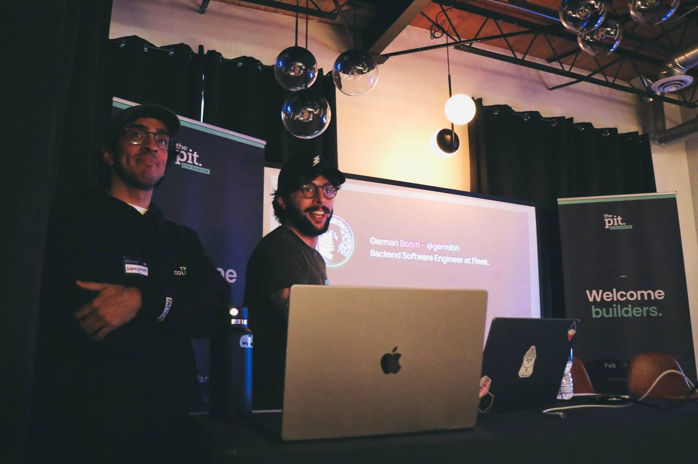
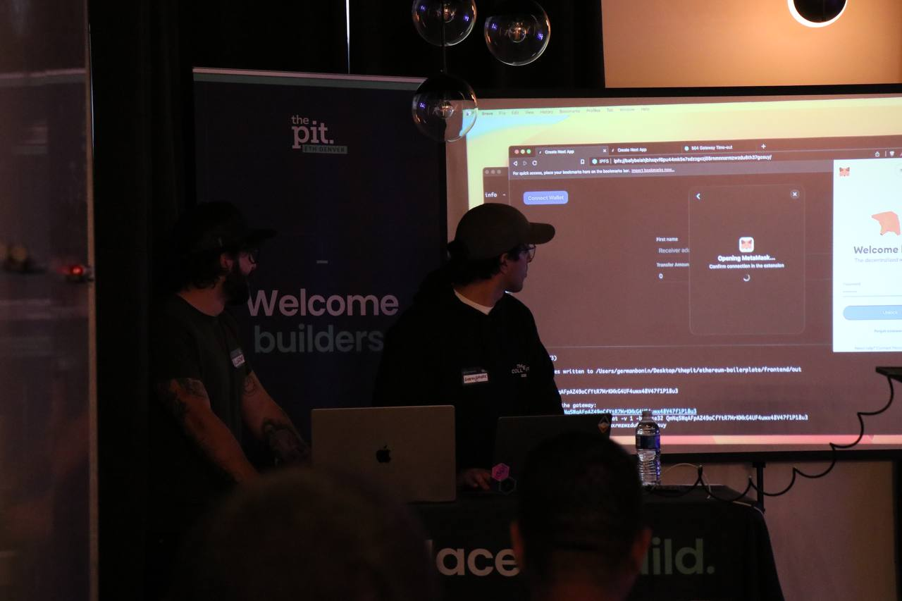
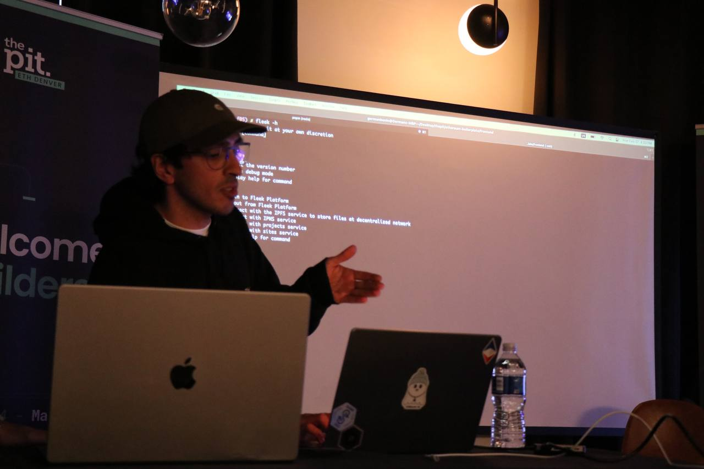

I've been meaning to write this for a couple of days, I'm gonna tell you about the time I've gave my first tech-workshop and production broke before stepping up to the scenario.

I'd say i've never had any trouble to speaking to large audiences, in fact, I do like storytelling and find some joy whenever I make people laugh and think for the good.

A good narrative will click on your brain, make you understand things, even more, for it to be clear enough makes you able to replicate that knowledge sharing with other people!, and that's a great skill to have.

This recalls to February/March 2023, (EthDenver). We were working hard on the new platform for https://fleek.co, and for our first releases, we went out with a CLI that enabled people to push their own sites through a IPFS gateway, and receive a hash (CID). 

I was given the chance to present this new platform on the EncodeClub Pit House (a really neat hacker house where people went and gave super interesting talks), and of course, I'd say yes. 

So I was mostly working within giving this presentation for the last week and a half, since it was my first _formal_ and _technical_ talk/workshop (you name it), I'd say I was kinda nervous. 

The presentation was simple enough, a little preview of how to deploy a site onto the decentralized IPFS protocol, what a CID is, how to visit your site through different gateways, nothing too fancy but really functional at the same time. 

Minutes before going up the stage, I receive a notification, *@here* on the discord dev core channel, saying that sites won't load (context: fleek is a site deployment platform, similar to vercel), and they're returning different errors. The error was on the cloudflare layer, so it was something quite difficult to debug at first glance. (Meaning we didn't have any internal monitoring tool by that time so we also couldn't catch anything at our internal services level).

This is not about that issue in particular but how can anything happen anytime in any context, and you have to be prepared for it. 

What's, literally the worst time for this to happen ? Of course, one minute before going up the scenario. I'm able to just pull up quickly my computer at the back of the room and give some insight on my works and what could be happening, closing the computer hoping for the better to be done when I'm over.

Relying on my peers was something I'd done blindly, and hoping for them to achieve a quick solution. Key thing is to *stay calm*.

Of course, in the meantime, trying to focusing on the presentation, the usual things happened: its a demo, it *will* go wrong, so you have to prepare some jokes or time savers for the time, and discipate the awkward moment from the audience. WiFi? Nope!, no internet at all. Production ? down as well. HDMI External connector ? clunky as well, was barely working too.

All this things get sorted out in matter of minutes usually, but for one up there feels like hours long, so again, its just about remaining calm and that people there are just for a good time, they won't be hard on you. (again, having jokes under the sleeve here is a super bonus hotfix)

Gladly, after some minor details, the presentation went really smooth. And minutes later, we did find out that the issue was behind alerts being received on an email from an ex coworker, since we did not notify from those, they did take down some of our services _unexpectedly_ (for us). 

PSA: Don't use personal accounts for company wide services, follow a proper process for sharing credentials at company wide level!.  

Key takeaway for this reading, is that, prepare for anything, literally, anything to happen whenever you're going to give a talk. 

Speaking on a stage to people is something super healthy and reinforces your soft traits, 100%. Anxiety and being nervous is something that's naturally going to happen, but once you're on the fly, those just go away. You just focus on that people are there to learn!. 

I'd totally give a talk again, so now I'm waiting again for a good conference and some presentations I've prepared in the meantime !.

