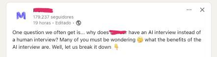

# AI Interviewing

I've been taking interviews lately, a lot. Among being ghosted, failing a couple of tech interviews or just simply not feeling quite to match the expected culture on the other side, there's something that did catch my attention. AI Interviewing. Yeah, that's it. 

For newcomers on the tech world, interviews (being a dev) usually go like ⇒ 

⇒  Hr screening (Just to doublecheck you're not a bot or a government spy)

⇒  Tech screening (usually either a live coding, a tech talk regarding past experiences, or smth related)

⇒ One more tech (systems design if you're more senior, or sometimes even a second round of coding, because making just one binary tree traversal in less than 30 mins is not enough for building endpoints that usually go like: GET `/users`)

⇒ Probably some culture fit / behavioral interview with upper management or C level 

Well, looks like with all the fuzz of AI and its advantages we've managed to reach places we've never considered (this is absolute sarcasm just in case jfc) and replaced the hr screening, and sometimes, the mid tech screening, with an AI. 

After going with at least 3 rounds with AI interviews, I'm just gonna say it, there's nothing "surprising” or "innovative” and the experience is beyond humiliating and horrible. The only pro it has is that you can select *any* time slot you feel it fits better. (Well, ofc, its just a computer). Anyway, the moment where you realize you're being assessed by a recopilation of data that went through a couple of training algorithms, and any emotion you involve whatsoever is not going to impact on the outcome, is just, sad. 

It feels pretty similar to when blockchain was blasting and the market just looked for ways of putting blockchain onto *everything* (literally: [https://thenextweb.com/news/bosch-blockchain-smart-fridge-dumb](https://thenextweb.com/news/bosch-blockchain-smart-fridge-dumb)). 

Among some interesting things, I've managed to find a pattern that I feel I should tell people to be aware of :

Some companies do the ethically wrong thing, as expected, and leverage the market unemployment situation with *apply for this job opening that casually matches your skills* Interview with out AI, and we'll get back to you!. (Surprise, the job doesn't exist and they just farm your data for training their AI.) 

On the other side, it also has a couple of benefits. As a developer, we're constantly dealing with, new technologies, new frameworks, new {little shiny thing we want to put pretty much in every piece of software and forget about it one month after}. Its mostly about this, about adapting and evolving, not trying to fight the evolution but to go along with it. 

With that being said, is not new that AI's can be "jailbreaked”, and hey, I invite you to not take this AI interviews as something serious, and try to experiment this with them. (Feel free to send me a DM asking for more info about this!!, its super fun)

Being dev means breaking things, find out how they work, spend 3 hours trying to see why the build doesn't go through and find out its because a case sensitive change on a file that github didn't catch. Things like that are what make this type of job fun (for me at least). Well, this is one of those opportunities! 

I find pretty exciting this uprising (and sort of cringy at the same time) of AI onto everything, and I personally think its a huge opportunity for mastering some infosec knowledge regarding AI and how to bypass/jailbreak it.