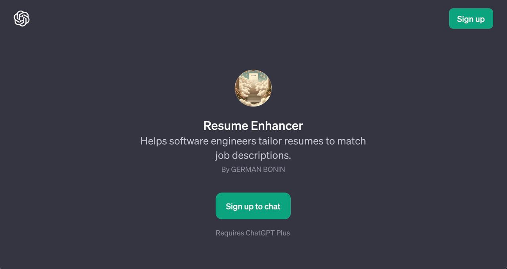
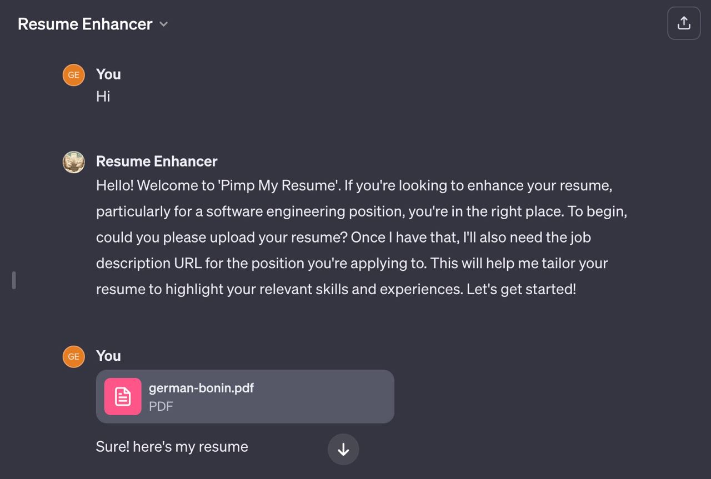

# Creating a GPT for boosting resumes

Couple of months ago I did sign up for an exciting challenge with a known nft platform which was looking to re design their existing services and help them allow more throughput and scale beyond the moon. From the looks, it was a great mission for me, I was looking for somewhere I could polish my technical skills and leverage my current knowledge to grow myself technically. 

Sadly, four weeks in, they did a mayor 50% layoff of the entire company, myself being affected too. 

I've been ever since with mixed emotions, not knowing if it was worth again investing my health, time, and energy into looking the *perfect* job. 

There're lots of times, whenever I face a great job description, that I think, *”Hey! it could be me this time*”, but for some reason, my bio doesn't match it entirely, and makes me fail the first barrier to landing an interview. 

That's the worst nightmare for facing frustration whenever looking for jobs, receiving the *"Hey! You're skills are amazing, and you have a super interesting resume, but we'll continue with other candidates better suited for this position”.* 

So thats why I've made a resume enhancer, I'm going to speak from my experience, sometimes we don't have the best bio to stand out among a particular job description and we miss that bullet!, or to put bluntly sometimes we use the same resume for N job positions. 

So, why not, GPTs hype train to the rescue. 

Resume Enhancer is tuned to give you feedback regarding your resume, and even more, look for the same skills that you share within that job description, make them stand out on your resume, and shine among the candidate pool. This **will not guarantee you landing the job, but for sure will give you more chances** whenever the recruiters are filtering candidates!. Remember, **its better to have a false positive rather than a missed match.** 

So to start, you should share your resume with Resume Enhancer, and the job description you're looking to apply for. 

With the resume uploaded, you just need to share a url with a job description to apply for, GPT will do the rest. 

[INSERT PIC]

Done!, thats it, now, it will retrieve some feedback. And suggest the things that you need to emphasis on. 

[Insert pic with emphasis and changes]

Thats it!.

Creating a GPT is simple, and cases are infinite, I'm super excited for whats to come. 

I'm gonna keep updating this GPT with more info and more fine instructions, in order to provide more accurate suggestions!.